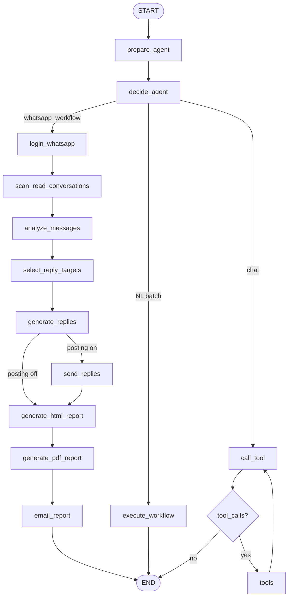

# WhatsApp Messaging Agent — Workflow

This document explains how the **WhatsApp Messaging Agent** works: Gmail browser login, inbox scanning, read-chat filtering, LangGraph graph structure, UI ↔ backend connection, browser lifecycle, reply generation from conversation context, screenshots, HTML reports, and email delivery.

---

## 1. Core concept: Gmail login + inbox scan

| Concept | `.env` variables | What happens |
|---------|------------------|--------------|
| **Gmail login** | `EMAIL`, `PASSWORD` | Playwright signs into Google/Gmail in the browser (like the old YouTube agent flow). |
| **Saved session** | `WHATSAPP_SESSION_PATH` | Cookies saved after login for reuse on the next run. |
| **WhatsApp Web** | — | After Gmail, opens web.whatsapp.com (QR scan on first run if needed). |
| **Inbox scan** | `MAX_CHATS_TO_PROCESS`, `CONTACT_FILTER` | Agent reads the chat list sidebar and opens eligible chats. |
| **Conversation context** | `MAX_MESSAGES_PER_CHAT` | Full thread is scraped; latest inbound messages drive reply generation. |
| **Send + screenshot** | `ENABLE_MESSAGE_REPLIES=true` | Types reply, clicks Send, saves screenshot to `reports/screenshots/`. |
| **Read chats only** | `REPLY_ONLY_READ_CHATS=true` | Skips chats with unread badges — you handle those manually for now. |
| **SMTP email reports** | `GMAIL_SMTP_USER`, `GMAIL_APP_PASSWORD` | Separate from `PASSWORD` — used only to send HTML reports. |

```
┌─────────────────────────────────────────────────────────────────────────┐
│                         AGENT EXECUTION FLOW                            │
├─────────────────────────────────────────────────────────────────────────┤
│  STEP 1 — LOGIN          EMAIL / PASSWORD → Gmail, then WhatsApp Web       │
│  STEP 2 — SCAN INBOX     Read chat list; filter read chats               │
│  STEP 3 — EXTRACT        Open each chat; scrape conversation             │
│  STEP 4 — PIPELINE       Analyze → Select targets → Generate replies     │
│  STEP 5 — SEND           Post replies + screenshot (optional)            │
│  STEP 6 — REPORT         HTML dashboard → PDF → Email                    │
└─────────────────────────────────────────────────────────────────────────┘
```

---

## 2. Architecture: Frontend + LangGraph backend

The **primary UI** is a React app in `frontend/`. It calls the **LangGraph Server** over HTTP and streams run events.

```
┌──────────────────┐     POST /threads                    ┌─────────────────────┐
│  Agent Web UI    │ ──▶ POST /threads/{id}/runs/stream ─▶│  LangGraph Server   │
│  localhost:5173  │     streamMode: updates, events,     │  localhost:2024     │
│  frontend/       │     values                           │  graph: agent       │
└──────────────────┘                                      └─────────────────────┘
         │                                                          │
         │  agentClient.ts (@langchain/langgraph-sdk)               │
         │  useAgentRun.ts → live pipeline steps                     ▼
         │                                                  Playwright + Groq + .env
```

### Connection layer (`frontend/src/lib/agentClient.ts`)

| Step | API | Purpose |
|------|-----|---------|
| Health | `GET /ok` | Sidebar shows LangGraph online/offline |
| Create thread | `POST /threads` | One thread per agent run |
| Stream run | `POST /threads/{id}/runs/stream` | Real-time node progress |

**Graph input** (per run from UI):

```json
{
  "messages": [],
  "user_input": "Scan WhatsApp inbox and reply to read conversations and email the HTML report",
  "contact_filter": "",
  "workflow_action": "email",
  "max_chats_to_process": 5,
  "max_messages_per_chat": 20,
  "max_replies_per_run": 5,
  "reply_only_read_chats": true,
  "enable_message_replies": false,
  "email_recipient": "you@example.com"
}
```

`prepare_agent` applies per-run overrides via `config.apply_runtime_overrides()`.

---

## 3. LangGraph node flow

### Graph nodes (LangSmith Studio)

| Node | Role |
|------|------|
| `prepare_agent` | Normalize input, apply per-run overrides, bootstrap messages |
| `decide_agent` | Route: WhatsApp pipeline vs `execute_workflow` vs general chat |
| `login_whatsapp` | Sign into Gmail (`EMAIL`/`PASSWORD`), then open WhatsApp Web |
| `scan_read_conversations` | Scan inbox, filter read chats, extract messages |
| `analyze_messages` | LLM-classify inbound messages |
| `select_reply_targets` | Pick up to N messages (one per contact) |
| `generate_replies` | Contextual AI replies using full conversation history |
| `send_replies` | Send via WhatsApp Web + screenshot when enabled |
| `generate_html_report` | HTML dashboard with message/reply log; **releases browser** |
| `generate_pdf_report` | PDF messaging report |
| `email_report` | Email HTML + PDF when `EMAIL_REPORTS=true` |
| `execute_workflow` | Batch mode for natural-language requests |
| `call_tool` / `tools` | General chat + PDF/email tools |

### Mermaid diagram (main pipeline)



---

## 4. WhatsApp Web DOM selectors

The agent uses these WhatsApp Web elements:

| Element | Selector |
|---------|----------|
| Chat list | `[data-testid="chat-list"]` |
| Chat row | `[data-testid="cell-frame-container"]` |
| Chat title | `[data-testid="cell-frame-title"]` |
| Unread badge | `[data-testid="icon-unread-count"]` |
| Message text | `p.selectable-text.copyable-text` |
| Compose input | `footer div[contenteditable="true"]` |
| Send button | `button[aria-label="Send"][data-tab="11"]` |

---

## 5. Message analysis vs reply selection

| Step | Scope | Config |
|------|-------|--------|
| `analyze_messages` | All inbound messages from read chats | Per `MAX_MESSAGES_PER_CHAT` |
| `select_reply_targets` | Up to N messages (one latest inbound per contact) | `MAX_REPLIES_PER_RUN` |

Reply generation receives `conversation_history` — the full scraped thread for that contact — so replies are contextually appropriate.

---

## 6. Browser session lifecycle

| Phase | Browser state |
|-------|---------------|
| `login_whatsapp` | Opens Chrome, logs into Gmail, then WhatsApp Web; stores session when `KEEP_BROWSER_OPEN=true` |
| `scan_read_conversations` | Reuses session; scans inbox and opens chats |
| `send_replies` | Reuses tab; types reply, clicks Send, captures screenshot |
| `generate_html_report` | `release_browser_session()` — Chrome closes **here** |
| PDF / email | No browser needed |

```env
KEEP_BROWSER_OPEN=true
BROWSER_HEADLESS=false   # recommended while debugging send/screenshots
```

---

## 7. State fields

| Field | Purpose |
|-------|---------|
| `contact_filter` | Optional inbox name filter |
| `conversations` | Per-chat scraped threads |
| `chat_messages` | Flattened inbound messages with `conversation_history` |
| `chats_scanned` / `read_chats_found` | Inbox scan stats |
| `screenshots` | Post-send screenshot paths per contact |
| `analyzed_messages` | Classified messages |
| `reply_targets` / `generated_replies` | Selected messages and AI drafts |
| `failed_replies` | Send failures with `post_error` |
| `html_path` / `pdf_path` | Report file paths |
| `llm_summary` | Executive summary in HTML dashboard |
| `logged_in` / `whatsapp_login_detail` | Session status |

---

## 8. Agent Web UI

### Pipeline steps (streamed live)

| Step | Graph node(s) | Emoji |
|------|---------------|-------|
| Agent Planning | `prepare_agent`, `decide_agent` | 🧠 |
| WhatsApp Login | `login_whatsapp` | 🔐 |
| Scan Inbox | `scan_read_conversations` | 📥 |
| Analyze Sentiment | `analyze_messages` | 🔍 |
| Select Reply Targets | `select_reply_targets` | 🎯 |
| Generate Replies | `generate_replies` | ✍️ |
| Send Replies | `send_replies` | 💬 |
| HTML Dashboard | `generate_html_report` | 📊 |
| PDF Report | `generate_pdf_report` | 📄 |
| Email Delivery | `email_report` | 📧 |

### UI controls

- **▶️ Start Agent** — full inbox pipeline
- **Contact filter** — optional partial name match
- **Max chats / messages / replies** — per-run limits
- **Only read chats** — skip unread (default on)
- **Enable message replies** — actually send on WhatsApp Web
- **Email recipient** — per-run override for `GMAIL_DEFAULT_RECIPIENT`

---

## 9. File map

```
WhatsAppMessagingAgent-/
├── README.md
├── AgentWorkflow.md              ← This file
├── frontend/                     ← Agent Web UI
│   ├── src/lib/agentClient.ts    ← LangGraph connection
│   ├── src/lib/streamProgress.ts ← Pipeline step streaming
│   └── src/hooks/useAgentRun.ts
├── langgraph.json
├── start.sh / setup.sh
├── .env.example
│
└── src/agent/
    ├── graph.py
    ├── config.py
    ├── workflow_executor.py
    ├── task_planner.py
    ├── routing.py
    └── custom_tools/
        ├── browser_tools.py      ← session, navigation
        ├── whatsapp_tools.py     ← inbox scan, send, screenshots
        ├── comment_selection.py  ← reply targets
        ├── comment_analyzer.py
        ├── reply_generator.py
        ├── html_report_generator.py
        ├── pdf_generator.py
        └── email_tools.py
```

---

## 10. Commands

```bash
./start.sh both       # LangGraph :2024 + UI :5173
./start.sh server     # LangGraph only
./start.sh ui         # UI only (start server separately)
./start.sh stop

uv run pytest tests/ -q
cd frontend && npm run build
```

First-time setup:

```bash
cp .env.example .env
chmod +x setup.sh start.sh
./setup.sh
# Set BROWSER_HEADLESS=false, run once, scan QR
```

---

## 11. Environment variables (reference)

### Session & login

| Variable | Default | Purpose |
|----------|---------|---------|
| `EMAIL` | — | Gmail address for Playwright browser login |
| `PASSWORD` | — | Gmail password for Playwright browser login |
| `WHATSAPP_SESSION_PATH` | `./data/whatsapp_session.json` | Saved browser session |
| `MAX_CHATS_TO_PROCESS` | `5` | Read chats to open per run |
| `MAX_MESSAGES_PER_CHAT` | `20` | Inbound messages per chat |
| `REPLY_ONLY_READ_CHATS` | `true` | Skip unread chats |
| `CONTACT_FILTER` | — | Optional name filter |

### Replies & browser

| Variable | Default | Purpose |
|----------|---------|---------|
| `MAX_REPLIES_PER_RUN` | `5` | Max replies per run |
| `REPLY_PERSONALITY` | `friendly` | Reply tone |
| `ENABLE_MESSAGE_REPLIES` | `false` | Send replies on WhatsApp Web |
| `KEEP_BROWSER_OPEN` | `true` | Reuse Chrome through send |
| `BROWSER_HEADLESS` | `true` | Headless Chromium |

### Email

| Variable | Purpose |
|----------|---------|
| `EMAIL_REPORTS` | Send reports via Gmail |
| `GMAIL_*` | SMTP credentials and default recipient |

---

## 12. Debugging

| Symptom | Check |
|---------|-------|
| UI shows LangGraph offline | `./start.sh server` or `./start.sh both`; `curl http://127.0.0.1:2024/ok` |
| Gmail login fails | Set `EMAIL` and `PASSWORD` in `.env`; use `BROWSER_HEADLESS=false` for Google security prompts |
| Not logged in to WhatsApp | `BROWSER_HEADLESS=false`, scan QR, confirm `whatsapp_session.json` exists |
| No chats processed | All chats may be unread; set `REPLY_ONLY_READ_CHATS=false` to test |
| Replies fail to send | `BROWSER_HEADLESS=false`; confirm compose box visible; see HTML **Failed Reply Attempts** |
| Empty report | Check `read_chats_found` in UI; widen `CONTACT_FILTER` or increase `MAX_CHATS_TO_PROCESS` |

---

## 13. Extending the workflow

1. Add tool logic in `custom_tools/`.
2. Add executor in `workflow_executor.py`.
3. Add graph node + edges in `graph.py`.
4. Add pipeline step in `frontend/src/lib/workflowSteps.ts`.
5. Add tests and update this document.
